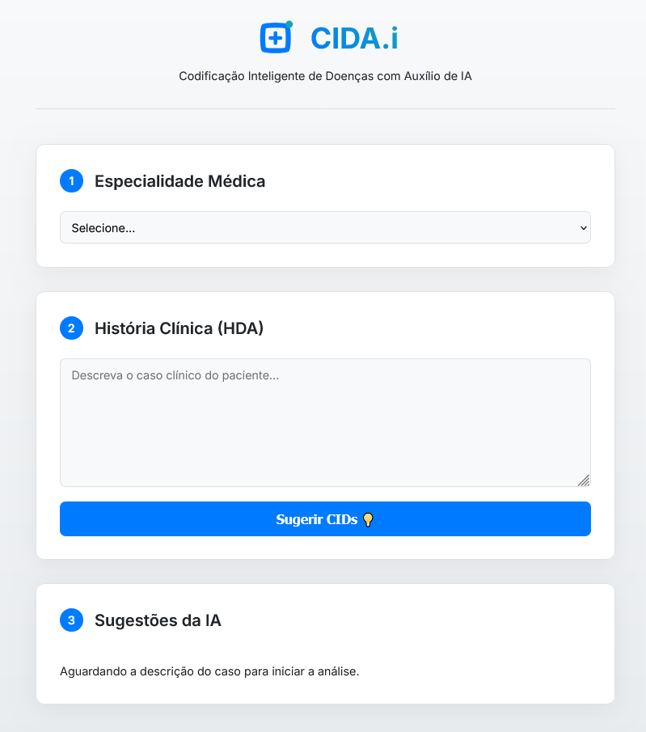

# CIDA.i - Assistente de Codificação Médica com IA

Aplicação web que utiliza a API do Google Gemini para sugerir códigos da CID-10 a partir de descrições de casos clínicos em linguagem natural.

<div align="center">

<!-- BADGES DE TECNOLOGIA -->


<!-- BADGES DE DEPLOYMENT -->


</div>

---

## 🚀 Acessar a Aplicação

<!-- A aplicação está disponível para uso na web. -->

<!-- **[Clique aqui para acessar o CIDA.i ao vivo!](https://fhcflx.github.io/cida-i/)** -->

Para utilizar a aplicação, siga as [instruções](#-como-executar-o-projeto-localmente) para executá-lo localmente.

<br>

<div align="center">
  
</div>

<br>

## 📋 Sobre o Projeto

**CIDA.i** (Codificação Inteligente de Doenças com Auxílio de IA) é uma ferramenta de apoio projetada para profissionais da saúde. A partir de um texto descrevendo a história clínica (HDA) de um paciente e a especialidade médica, a aplicação se conecta à API do Google Gemini para analisar o contexto e sugerir os códigos da Classificação Internacional de Doenças (CID-10) mais relevantes, incluindo uma justificativa para cada sugestão.

---

## ⚠️ Aviso Ético e de Responsabilidade

**Este é um projeto experimental e de portfólio. Seu uso em um ambiente clínico real exige a consideração dos seguintes pontos cruciais:**

- **Ferramenta de Apoio:** Esta aplicação deve ser usada exclusivamente como um **apoio à codificação** para profissionais qualificados. As sugestões geradas pela IA **não substituem o julgamento clínico, a anamnese ou a avaliação de um profissional de saúde**.

- **Revisão Humana Obrigatória:** Toda e qualquer sugestão fornecida pela aplicação **deve ser obrigatoriamente revisada e validada** por um profissional competente antes de ser utilizada em qualquer prontuário ou documento oficial.

- **Não é um Dispositivo Médico:** A aplicação **não oferece diagnóstico, terapia ou qualquer tipo de recomendação médica**. Seu propósito é estritamente informacional e experimental.

- **Proteção de Dados:** Ao utilizar a ferramenta com dados que possam identificar pacientes, o usuário é inteiramente responsável por cumprir com as leis de proteção de dados, como a LGPD (Lei Geral de Proteção de Dados), garantindo a **anonimização ou pseudonimização** das informações.

> Pessoas com sinais ou sintomas de doenças devem procurar um profissional ou serviço de saúde qualificado.

---

## 🏗️ Arquitetura

Este projeto utilizou uma arquitetura desacoplada, com o frontend e o backend hospedados em plataformas distintas para otimizar a performance e a segurança:

- **Frontend:** Hospedado como um site estático no **GitHub Pages**. É responsável por toda a interface do usuário.
- **Backend:** Hospedado como um Web Service na **Render.com**. Responsável por processar as requisições, gerenciar a chave da API do Google e se comunicar com o modelo Gemini.

O fluxo foi o seguinte: `Usuário no GitHub Pages ➡️ Requisição API ➡️ Backend na Render ➡️ API do Google Gemini`

O app funcionou a contento com este set-up, e suas respostas foram aparentemente dentro do contesto esperado. Após o teste, o serviço foi desativado, ficando disponível a opção de uso local (vide instruções).

---

## ✨ Funcionalidades

- **Interface Moderna:** Design limpo e responsivo, focado na usabilidade.
- **Análise por IA:** Utiliza o poder dos Large Language Models (LLM) do Google para uma compreensão semântica do texto clínico.
- **Seleção de Especialidade:** Permite contextualizar a busca para obter resultados mais precisos.
- **Sugestões Justificadas:** Além do código, a IA fornece uma breve explicação sobre por que cada CID é relevante.
- **Feedback Visual:** O usuário é informado visualmente enquanto a análise está sendo processada.

---

## 🛠️ Tecnologias Utilizadas

- **Frontend:** HTML5, CSS3, JavaScript (ES6+)
- **Backend:** Node.js, Express.js
- **Inteligência Artificial:** Google Gemini API (`@google/generative-ai`)
- **Deployment testado:** GitHub Pages (Frontend), Render.com (Backend)
- **Gerenciamento de Ambiente:** `dotenv`

---

## 🚀 Como Executar o Projeto Localmente

Siga os passos abaixo para executar a aplicação em seu ambiente local para desenvolvimento.

```bash
# 1. Clone o repositório
git clone https://github.com/fhcflx/cida-i.git

# 2. Acesse a pasta do projeto
cd cida-i

# 3. Instale as dependências do backend
npm install
```

## Configuração da Chave de API

Para que a aplicação se comunique com a IA do Google, você precisa da sua chave de API.

1. Crie um arquivo chamado .env na raiz do projeto.

2. Dentro deste arquivo, adicione a seguinte linha, substituindo SUA_CHAVE_AQUI pela sua chave da API do Gemini:

```code
# .env
GOOGLE_API_KEY=SUA_CHAVE_AQUI
```

## Execução do Servidor

Iniciando a Aplicação

```bash
# Execute o servidor Node.js
node server.js
```

Após executar o comando acima, a aplicação estará disponível em seu navegador no endereço http://localhost:3000.
Para acessar o frontend, abra o arquivo index.html com seu navegador (se não funcionar com um deles, teste outro).

## 📄 Licença

Este projeto está sob a licença MIT. Veja o arquivo [LICENSE](LICENSE) para mais detalhes.
Esta é uma ferramenta experimental. Não insira dados sensíveis. As sugestões da IA exigem validação profissional. Ao usar, você concorda com os [Termos de Uso e Responsabilidade](https://fhcflx.github.io/cida-i/terms.html).

_Feito com ❤️ por Francisco Felix, em 2025_
